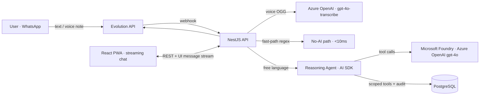

# MayordomoAI 🤖💸

**A reasoning agent that manages your personal finances over WhatsApp and the web — built on Microsoft Foundry.**

Users organize money into _mini-boxes_ (envelope budgeting) with percentage-based allocation. They talk to the agent in natural language — text or **voice notes** — through WhatsApp or a web chat, and the agent reasons over their real data with audited tools.

> 🏆 Agents League Hackathon — **Reasoning Agents track** (Microsoft Foundry / Azure OpenAI)

---

## Reasoning patterns

| Pattern                         | Where it lives                                                                                                              |
| ------------------------------- | --------------------------------------------------------------------------------------------------------------------------- |
| **Planner-Executor**            | The agent decides which tools to call and in what order (`streamText` + tool loop, max 5 steps)                             |
| **Adaptive clarification loop** | Ambiguity is never discarded: the agent asks short, targeted questions and resumes with conversation memory                 |
| **Critic / Verifier**           | Expenses ≥ S/100 and voice-transcribed amounts require explicit user confirmation — **enforced server-side**, not by prompt |
| **Role-based specialization**   | Parser (fast-path / gpt-4o-mini) · Consultant (read tools) · Registrar (write tools with confirmation)                      |

## Safety & Reliability

- **User isolation**: `userId` is injected by the backend from the session/phone number — _never_ by the model. Every tool is scoped.
- **Zero invented figures**: the agent answers only with tool results; user text and bank receipts are treated as _data_, not instructions (prompt-injection resistant).
- **Reasoning trail**: every tool call (name, args, result) is audited in `tool_audits` and visible in the dashboard (`/agente`) — full replayability.
- **Financial integrity**: amounts in `numeric(12,2)`, splits computed in integer cents (largest-remainder, sums are exact), balances always derived via `SUM()` — never stored. Deletes are soft (`voided`), never physical.
- **Hard iteration cap** (5 steps) and webhook idempotency by WhatsApp message id.

## Architecture



One agent, two channels: WhatsApp and the web chat share the same brain, the same tools, and the same conversation memory (the WhatsApp thread is pinned in the web UI — you can continue the conversation from either side).

## Stack

NestJS 11 · React 19 + Vite · TailwindCSS v4 · PostgreSQL 16 (TypeORM, migration-first) · **AI SDK + `@ai-sdk/azure`** (Microsoft Foundry) · Evolution API (WhatsApp) · pnpm monorepo with shared Zod contracts.

## Quickstart (reproducible)

```bash
cp .env.example .env        # defaults work out of the box
pnpm install
pnpm --filter @app/contracts build
pnpm db:up && pnpm migration:run && pnpm seed   # seeds demo data
pnpm dev                    # API :3000 · Web :5173
```

Login with the seeded demo account (`ADMIN_EMAIL` / `ADMIN_PASSWORD` from `.env`). The app **boots without AI credentials** — dashboard, boxes and transactions work fully; the chat gracefully asks for an Azure OpenAI key.

To enable the agent, deploy `gpt-4o`, `gpt-4o-mini` and `gpt-4o-transcribe` in [Microsoft Foundry](https://ai.azure.com) and set:

```env
AZURE_RESOURCE_NAME=your-resource
AZURE_API_KEY=your-key
```

WhatsApp is optional and plugs in with `EVOLUTION_*` vars (see `.env.example`).

## Demo video

📹 _(link — ≤ 5 min)_

## Team

Joao Souza — Microsoft Learn: _(username)_
