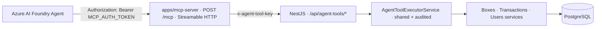
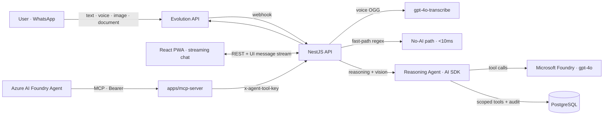

# MayordomoAI 🤖💸

**A multimodal reasoning agent that manages your personal finances over WhatsApp, the web, and Azure AI Foundry — built on Microsoft Foundry.**

Users organize money into _mini-boxes_ (envelope budgeting) with percentage-based allocation. They talk to the agent in natural language — **text, voice notes, photos of receipts, or documents (PDF / Excel / Word)** — through WhatsApp or a web chat, and the agent reasons over their real data with audited, server-guarded tools. Those same tools are now exposed to **Azure AI Foundry** agents through a remote **MCP server**.

> 🏆 Agents League Hackathon — **Reasoning Agents track** (Microsoft Foundry / Azure OpenAI)

---

## ✨ What's new

|     | Capability                                                                                                                           | Channels         |
| --- | ------------------------------------------------------------------------------------------------------------------------------------ | ---------------- |
| 🎙️  | **Voice notes** → transcribed with `gpt-4o-transcribe`, then reasoned over                                                           | WhatsApp · Web   |
| 📸  | **Photos / receipts** → understood by `gpt-4o` vision; the agent extracts amount, merchant and date and **proposes** a transaction   | WhatsApp · Web   |
| 📄  | **Documents** → PDF, Word (DOCX), Excel (XLSX) and CSV parsed server-side and read by the agent (bank statements, expense sheets)    | WhatsApp · Web   |
| 🔌  | **MCP server** → Azure AI Foundry agents call the finance tools over the Model Context Protocol — **with no direct database access** | Azure AI Foundry |

Every modality flows through the **same audited tool layer** and the **same server-side guardrails** — user text, receipts and documents are treated as _data_, never as instructions.

## Reasoning patterns

| Pattern                         | Where it lives                                                                                                                                       |
| ------------------------------- | ---------------------------------------------------------------------------------------------------------------------------------------------------- |
| **Planner-Executor**            | The agent decides which tools to call and in what order (`streamText` + tool loop, hard cap **8 steps**)                                             |
| **Adaptive clarification loop** | Ambiguity is never discarded: the agent asks short, targeted questions and resumes with conversation memory                                          |
| **Critic / Verifier**           | Expenses ≥ S/100 and voice-transcribed amounts require explicit user confirmation — **enforced server-side**, not by prompt                          |
| **Role-based specialization**   | Parser (fast-path / `gpt-4o-mini`) · Consultant (read tools) · Registrar (write tools with confirmation)                                             |
| **Multimodal grounding**        | Images → vision parts; documents → server-side text extraction injected as context; both are bounded and stripped from history to control token cost |

## Multimodal input

| Input    | How it's handled                                                                                         | Limits                      |
| -------- | -------------------------------------------------------------------------------------------------------- | --------------------------- |
| Audio    | Transcribed via `gpt-4o-transcribe`, then fed as text (user can review before sending on web)            | 5 MB                        |
| Image    | Passed inline to `gpt-4o` vision; ephemeral (only metadata persisted, never the binary)                  | 2 images, 4 MB each         |
| Document | Extracted to text server-side (`pdf-parse`, `mammoth`, `xlsx`, RFC-4180 CSV) and injected as a text part | 1 doc, 8 MB, PDF ≤ 30 pages |

Scanned/image-only PDFs (no text layer) are detected and reported instead of feeding garbage to the model. Image and document **binaries are never stored** — conversation history keeps only a `[image: …]` / `[document: …]` placeholder.

## Tools as an MCP server (Azure AI Foundry)

The agent's finance tools are exposed to external Foundry agents through a standalone remote MCP server (`apps/mcp-server`) that **never touches the database** — it only validates auth and forwards to a secure internal REST layer on the backend.



- **Two auth layers**: Foundry → MCP (`Bearer`) and MCP → backend (`x-agent-tool-key`). Both fail closed.
- **Identity is server-resolved**: `userId` is never accepted from Foundry, the MCP server, or any request body — it is resolved inside the backend. No tool exposes a `userId` argument.
- **One source of truth**: the in-app agent and the MCP/REST path share the same `AgentToolExecutorService`, so confirmation thresholds, financial rules and the `tool_audits` trail are never duplicated.
- **Sanitized**: no stack traces, secrets or raw errors are ever returned to the agent.
- MVP exposes 3 of the 12 tools (`getBoxBalances`, `queryTransactions`, `registerTransaction`); the structure is ready for the rest. See [`apps/mcp-server/README.md`](apps/mcp-server/README.md) for the full deploy + Foundry connection guide.

## Safety & Reliability

- **User isolation**: `userId` is injected by the backend (session / phone number / server-side env) — _never_ by the model or a remote caller. Every tool is scoped.
- **Zero invented figures**: the agent answers only with tool results; user text, receipts and documents are _data_, not instructions (prompt-injection resistant).
- **Reasoning trail**: every tool call (name, args, result) is audited in `tool_audits` and visible in the dashboard (`/agente`) — full replayability, across all channels and the MCP path.
- **Financial integrity**: amounts in `numeric(12,2)`, splits in integer cents (largest-remainder, exact sums), balances derived via `SUM()` (never stored). Deletes are soft (`voided`).
- **Hard iteration cap** (8 steps), webhook idempotency by WhatsApp message id, and bounded media sizes to protect memory and token budget.

## Architecture



One agent, three surfaces: WhatsApp, the web chat, and Azure AI Foundry share the same brain, the same tools, and the same audited execution. The WhatsApp thread is pinned in the web UI — you can continue the conversation from either side.

## Monorepo

| Path                 | Package           | What                                                          |
| -------------------- | ----------------- | ------------------------------------------------------------- |
| `apps/api`           | `@app/api`        | NestJS 11 backend — agent, tools, internal tool API, channels |
| `apps/web`           | `@app/web`        | React 19 + Vite 7 PWA — streaming chat, dashboard, boxes      |
| `apps/mcp-server`    | `@app/mcp-server` | Remote MCP server bridging Azure AI Foundry to the tool API   |
| `packages/contracts` | `@app/contracts`  | Shared Zod schemas / types (single source of truth)           |
| `packages/i18n`      | `@app/i18n`       | i18n resources + money formatting                             |
| `packages/tsconfig`  | `@app/tsconfig`   | Shared TypeScript configs                                     |

## Stack

NestJS 11 · React 19 + Vite · TailwindCSS v4 · PostgreSQL 16 (TypeORM, migration-first) · **AI SDK + `@ai-sdk/azure`** (Microsoft Foundry) · `@modelcontextprotocol/sdk` (remote MCP) · Evolution API (WhatsApp) · pnpm monorepo with shared Zod contracts.

## Quickstart (reproducible)

```bash
cp .env.example .env                 # defaults work out of the box
pnpm install
pnpm --filter "./packages/**" build  # build shared packages first (contracts + i18n)
pnpm db:up && pnpm migration:run && pnpm seed   # seeds demo data
pnpm dev                             # API :3000 · Web :5173
```

Login with the seeded demo account (`ADMIN_EMAIL` / `ADMIN_PASSWORD` from `.env`). The app **boots without AI credentials** — dashboard, boxes and transactions work fully; the chat gracefully asks for an Azure OpenAI key.

To enable the agent, deploy `gpt-4o`, `gpt-4o-mini` and `gpt-4o-transcribe` in [Microsoft Foundry](https://ai.azure.com) and set:

```env
AZURE_RESOURCE_NAME=your-resource
AZURE_API_KEY=your-key
```

WhatsApp is optional and plugs in with `EVOLUTION_*` vars. The MCP server and the Foundry integration have their own env (`AGENT_TOOL_INTERNAL_KEY`, `FOUNDRY_DEMO_USER_ID`, `MCP_AUTH_TOKEN`) — see `.env.example` and [`apps/mcp-server/README.md`](apps/mcp-server/README.md).

## Deploy

Each app deploys independently on **Coolify** from its own Dockerfile (`apps/*/Dockerfile`), auto-deployed on push to `main`:

- API → `https://api.mayordomoai.xyz`
- MCP server → `https://mcp.mayordomoai.xyz` (Foundry endpoint: `…/mcp`)

## Demo video

📹 _(link — ≤ 5 min)_

## Team

Joao Souza — Microsoft Learn: _(username)_
