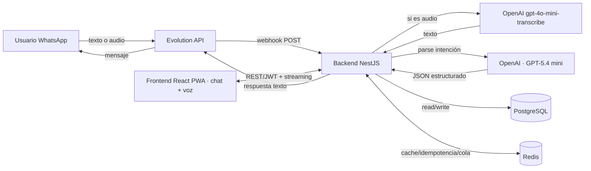
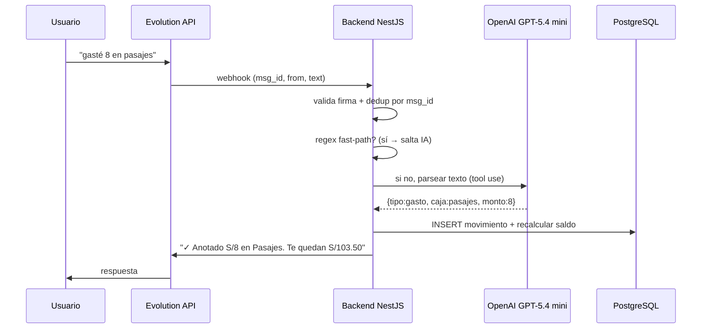
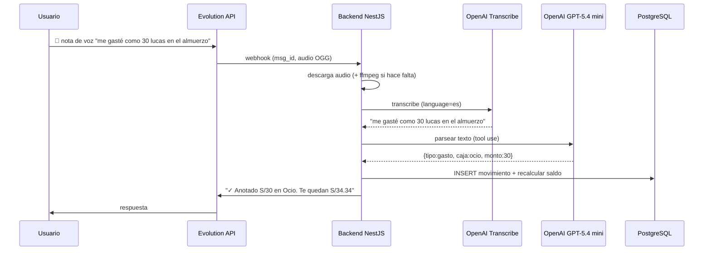
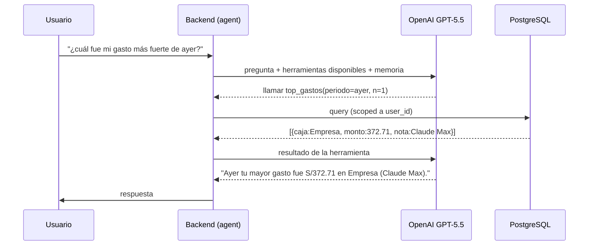
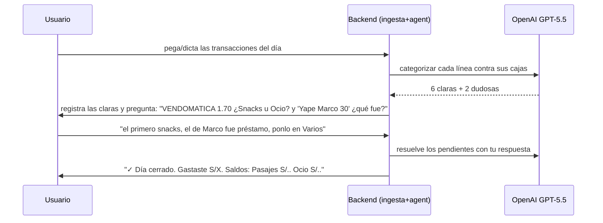
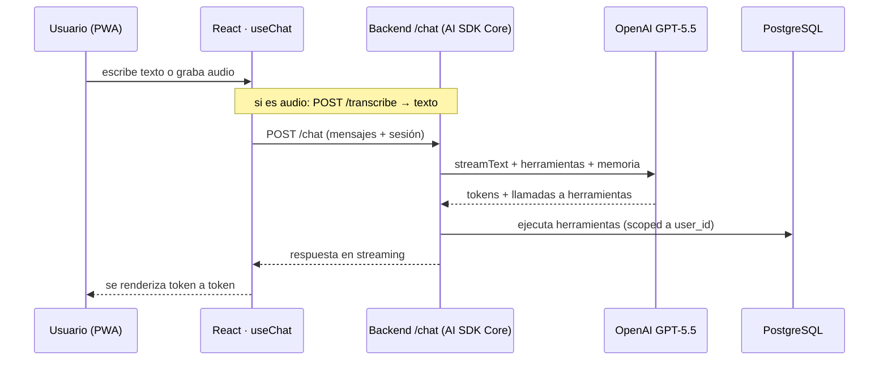

# Mayordomo — Arquitectura (mini-cajas + asistente WhatsApp)

> Sistema de sobres/mini-cajas con registro por WhatsApp en lenguaje natural.
> Self-hosted en tu servidor (Coolify + Docker). Stack: NestJS · React/Vite (PWA) · PostgreSQL · Evolution API · OpenAI API · AI SDK (chat/streaming).

---

## 1. Visión general

El usuario le escribe (o le habla) a un número de WhatsApp. El sistema no solo registra movimientos:
es un **agente conversacional** que entiende preguntas libres ("¿en qué gasté la semana pasada?",
"¿cuál fue mi gasto más fuerte de ayer?"), consulta tu base de datos con herramientas, mantiene el
hilo de la charla y **te pregunta cuando algo no le cuadra** — como hablar con un asistente. Cada noche
puedes pasarle las transacciones del día y él las categoriza, registrando lo claro y preguntándote lo dudoso.
Hay además una PWA para ver el dashboard, editar % y revisar historial.



**Regla de oro del diseño:** todo lo que se puede registrar por WhatsApp se puede ver/editar en la PWA,
y ambos usan exactamente el mismo backend y la misma base de datos. WhatsApp es solo un canal de entrada.

---

## 2. Componentes

### 2.1 Frontend — React + Vite + TypeScript + Tailwind (PWA)
- Dashboard de cajas (saldo, % usado, barras), mismo concepto que el Excel.
- **Chat con el asistente** (el mismo agente que en WhatsApp), con texto y **grabación de audio**.
- Pantalla de registro manual (por si no quiere usar WhatsApp).
- Configuración de cajas y % (con validación de que sumen 100%).
- Historial de movimientos con filtros.
- **Historial de conversaciones** (WhatsApp + web) en una sola línea de tiempo.
- Reportes / gráficos por mes.
- Login (JWT). PWA instalable en el celular.

> **Stack UI:** React + Vite + TypeScript + **TailwindCSS + shadcn/ui** (componentes) + **React Query (TanStack)** para data-fetching/caché. **Auth: Google OAuth** (inicias sesión con tu Gmail); al principio con allowlist (solo tu cuenta activa).

**Interfaz de chat — AI SDK (Vercel):**
- Usa **AI SDK UI** (`@ai-sdk/react`, hook `useChat`) para el chat con **streaming** — las respuestas aparecen token a token sin que tengas que parsear nada. Opcional: **AI Elements** (`npx ai-elements`) te da componentes de chat ya hechos (burbujas, input, estados de carga) para no diseñarlos desde cero.
- `useChat` apunta a un endpoint de tu backend (`POST /chat`) que responde en streaming. **No necesitas Vercel ni Next.js:** el AI SDK es una librería npm open-source que corre igual en tu servidor con NestJS + Coolify.
- **Voz en la PWA:** grabas con `MediaRecorder` del navegador → mandas el audio a `POST /transcribe` → recibes el texto → lo envías por `useChat` como un mensaje más. Mismo resultado que una nota de voz de WhatsApp.
- **Clave:** WhatsApp y este chat web son **dos frentes del mismo agente**. La lógica (herramientas, memoria, guardrails) vive una sola vez en el backend; ambos canales la consumen.

### 2.2 Backend — NestJS (módulos)
| Módulo | Responsabilidad |
|---|---|
| `auth` | Registro/login, JWT, guard de rutas |
| `users` | Perfil; vincula número de WhatsApp ↔ usuario |
| `cajas` | CRUD de cajas y sus % de asignación |
| `movimientos` | Crear/listar ingresos y gastos; cálculo de saldos |
| `whatsapp` | Webhook entrante + cliente para responder vía Evolution |
| `ai` | Servicio que llama a OpenAI y devuelve la intención estructurada |
| `agent` | Orquesta el bucle agéntico: razona, llama herramientas de consulta, mantiene la conversación |
| `ingesta` | Recibe el lote de transacciones de la noche, categoriza y junta los pendientes a preguntar |
| `transcription` | Descarga el audio y lo transcribe (OpenAI) antes de pasarlo a `ai` |
| `reports` | Resúmenes, totales por mes, export |

El backend es la **única** fuente de verdad. Ni el webhook ni la PWA tocan la BD directamente.

> **Persistencia:** TypeORM con **migraciones siempre** (`synchronize: false`, sin excepción). Cada cambio de esquema = una migración versionada.

### 2.3 Base de datos — PostgreSQL + TypeORM
Esquema mínimo (las columnas son casi 1:1 con tu Excel):

```
users         (id, nombre, email, password_hash, whatsapp_e164, created_at)
cajas         (id, user_id, nombre, porcentaje, tipo['personal'|'empresa'], orden, activa)
movimientos   (id, user_id, tipo['ingreso'|'gasto'], caja_id?, monto, fecha,
               nota, origen['whatsapp'|'pwa'], estado['confirmado'|'pendiente'],
               wa_message_id?, created_at)
periodos      (id, user_id, mes, año, ingresos_total, cerrado)   -- opcional, para cortes
wa_inbound_log(wa_message_id PK, user_id, payload, processed_at) -- idempotencia
conversaciones(id, user_id, abierta, last_at)                    -- hilo del agente
mensajes      (id, conversacion_id, rol['user'|'assistant'|'tool'], contenido, created_at)
```

- `movimientos.caja_id` es **nulo** para ingresos (la distribución se hace por % al consultar saldos).
- `cajas.tipo` permite separar "empresa" de "personal" (la recomendación de las dos cajas).
- `wa_message_id` con índice único evita registrar dos veces un mensaje reenviado.

**Cálculo de saldo de una caja** (vista o query):
```
asignado = (SUM ingresos del periodo) * caja.porcentaje
gastado  = SUM(movimientos.gasto WHERE caja_id = caja.id en el periodo)
saldo    = asignado - gastado
```

### 2.4 WhatsApp — Evolution API
- Corre como contenedor propio; expone API para enviar mensajes y dispara un **webhook** a tu backend en cada mensaje entrante.
- Tu backend implementa `POST /webhook/whatsapp` (valida, deduplica, procesa, responde).
- ⚠️ **Consideración real:** Evolution usa la conexión no oficial de WhatsApp (Baileys). Es gratis y self-hosted, pero conlleva **riesgo de baneo** del número. La alternativa oficial es la **WhatsApp Cloud API de Meta** (más trámite, pero sin riesgo de baneo y con plantillas aprobadas). Para un MVP personal Evolution está bien; si esto crece a producto, migra a Cloud API.
- **Modelo multiusuario:** una sola instancia = el **número-bot** al que todos escriben. Cada usuario registra (y **verifica**) en el dashboard el **número desde el cual escribirá**; el backend identifica al usuario por el número remitente del webhook. La verificación es obligatoria para que nadie reclame un número ajeno (ver edge cases en el plan).

### 2.5 Motor de IA — OpenAI API
Todo el procesamiento de lenguaje y de voz corre sobre **OpenAI**: un solo proveedor, una sola API key.
- **Modelos (ruteo por complejidad):**
  - `gpt-5.4-mini` (~$0.75/M in · $4.50/M out) → parseo y clasificación de un mensaje, fast-path. Barato y rápido. (Para volumen extremo existe `gpt-5.4-nano`, aún más barato.)
  - `gpt-5.5` (~$5/M in · $30/M out, **cacheado $0.50/M**) → el agente: razonamiento, orquestación de herramientas, ingesta nocturna. OpenAI lo recomienda para tareas agénticas complejas.
- **Function calling + Structured Outputs** para forzar salida estructurada (JSON validado contra un schema), en vez de parsear texto libre:
  ```
  registrar_movimiento(tipo, caja, monto, fecha?, nota?)
  consultar_saldo(caja?)
  generar_resumen()
  ```
  Usa la **Responses API** (la moderna de OpenAI para tools/agentes).
- **Prompt caching** del system prompt (lista de cajas + reglas del usuario) → hasta ~90% de ahorro en los tokens de entrada repetidos.
- **Fast-path con regex** para frases estructuradas comunes ("gasté 8 en pasajes"): resuélvelo sin llamar a la API (gratis y <10 ms). Solo cae al modelo cuando el regex no matchea (lenguaje libre: "me tomé un café con los chicos, 12 lucas").
- **Costo estimado:** ~600 tokens por mensaje con caching ≈ fracciones de centavo. Aun con miles de mensajes al mes, el motor te cuesta unos pocos dólares. La clave: modelo mini + caching + fast-path de regex; reserva `gpt-5.5` solo para los turnos del agente.

> **Tip de arquitectura:** el **AI SDK** (`npm i ai`) es justo esa capa de abstracción. En el backend usas su núcleo (`streamText`, `generateObject`, tools) con el proveedor OpenAI (`@ai-sdk/openai`, modelos tipo `openai/gpt-5.4`); en el frontend, sus hooks (`useChat`). Toda tu IA pasa por ahí, así que cambiar de proveedor más adelante es prácticamente una línea y el resto del sistema no se entera. Además te da transcripción y streaming en la misma librería.

### 2.6 Transcripción de voz — OpenAI
- Cuando el mensaje de WhatsApp es una **nota de voz**, Evolution entrega el audio (base64 o un endpoint de media). El backend lo descarga y lo manda a transcribir.
- Modelo recomendado: **`gpt-4o-mini-transcribe`** — el más barato a **$0.003/min**, y para notas de voz limpias es más que suficiente; si necesitas más precisión con nombres/acentos, sube a `gpt-4o-transcribe` ($0.006/min). Ambos soportan 99+ idiomas (español incluido), por el endpoint `/v1/audio/transcriptions`.
- Pásale `language: "es"` para forzar español y mejorar precisión/latencia.
- **Formato:** WhatsApp envía las notas de voz en **OGG/Opus**. OpenAI acepta ogg/webm/mp3/m4a/wav (hasta 25 MB). Si algún audio te da problema, transcodifica con **ffmpeg** a mp3/wav (incluye ffmpeg en el contenedor del backend).
- **Lo elegante:** una vez transcrito, el texto entra al **mismo pipeline** que un mensaje escrito (regex → OpenAI). Voz y texto comparten todo el camino; solo cambia el primer paso.
- **Costo:** una nota de voz típica (~15 s) cuesta ~$0.0008 de transcripción + la fracción de centavo del parseo. Voz sigue siendo prácticamente gratis a tu volumen.
- **Importante:** la transcripción puede equivocarse. Para montos altos o texto dudoso, que el bot **devuelva lo que entendió y pida confirmación** ("Entendí: gasto S/80 en Empresa. ¿Confirmas? sí/no") antes de registrar.

---

## 3. Flujos

### 3.1 Registrar un gasto (lenguaje natural)


### 3.2 Registrar un ingreso (se reparte solo)
"me entró 500" → se inserta el ingreso → el sistema responde con el desglose:
"S/500 repartidos: Diezmo S/50 · Ofrenda S/25 · Ahorro S/100 · Pasajes S/65 …"

### 3.3 Pedir resumen
"resumen" → genera el estado de todas las cajas (texto, y opcionalmente una imagen/PDF adjunto).

### 3.4 Registrar por nota de voz

A partir de la transcripción, el camino es idéntico al de un mensaje de texto.

### 3.5 Pregunta libre (modo agente)


### 3.6 Cierre nocturno (comparte el día; te pregunta lo dudoso)


### 3.7 Chat en la PWA (texto y voz, con AI SDK)

Mismo agente y mismas herramientas que en WhatsApp; solo cambia el canal de entrada/salida.

---

## 4. Capa de agente conversacional (lo que lo vuelve un asistente)

Hasta aquí el bot "clasifica" un mensaje en una operación. Un **agente** razona, decide qué datos
necesita, consulta la base con herramientas, recuerda el hilo y pregunta cuando algo no le cuadra.
Es la diferencia entre un comando y conversar con un asistente.

### 4.1 El bucle agéntico (tool use)
Le das al modelo (OpenAI) un set de **herramientas de lectura** sobre tu base y él decide cuáles usar para
responder cualquier pregunta. Lee el resultado, y si necesita más, llama otra; cuando tiene lo
suficiente, responde en lenguaje natural.

Herramientas sugeridas (todas devuelven SOLO datos del usuario autenticado):
- `consultar_movimientos(desde, hasta, tipo?, caja?, texto?, orden?, limite?)`
- `agregar_gastos(periodo, agrupar_por['caja'|'dia'|'semana'])`
- `top_gastos(periodo, n)` — los N mayores
- `saldo_cajas()` — estado actual de las cajas
- `comparar_periodos(a, b)` — esta semana vs la anterior
- `registrar_movimiento(...)` / `editar_movimiento(...)` — escritura, con confirmación

### 4.2 Memoria de conversación (multi-turno)
Para repreguntar y recordar el hilo, guarda `conversaciones` + `mensajes`. En cada turno le pasas a
al modelo los últimos N mensajes como contexto. Una sesión por hilo de WhatsApp, con timeout (ej. se
cierra tras unas horas de inactividad) para no arrastrar contexto viejo ni inflar tokens.

### 4.3 Preguntas de aclaración (el "como hablando contigo")
Cuando falta info o hay ambigüedad, el agente **no adivina: pregunta**. Sale natural del mismo bucle:
si le falta un dato, su mejor "acción" es responder con una pregunta y dejar el ítem en estado
`pendiente`. Tú contestas y, como hay memoria, retoma donde quedó. En montos altos o transcripciones
dudosas, confirma antes de escribir.

### 4.4 Cierre nocturno: ingesta con pendientes
Le pasas los movimientos del día (pegados, reenviados del banco, o dictados). El agente: (1) parsea y
propone cada uno categorizado; (2) registra lo claro; (3) junta lo que no entiende y te lo pregunta en
**una sola tanda**; (4) con tu respuesta cierra el día y te da el resumen + saldos. Las filas ambiguas
viven en `movimientos.estado = 'pendiente'` hasta que respondas.

### 4.5 Qué modelo para qué (ruteo por complejidad)
- **GPT-5.4 mini** (o `gpt-5.4-nano`) → parseo de un mensaje, fast-path, clasificación simple. Barato y veloz.
- **GPT-5.5** → el agente (preguntas libres, razonar sobre tus datos, manejar el hilo, decidir
  herramientas, la ingesta nocturna). Es el tier de razonamiento/agéntico y aquí sí aporta.
- Ruteas: patrón simple → mini; pregunta abierta o ingesta → GPT-5.5. Pagas el modelo grande solo cuando suma.

### 4.6 Guardrails (clave: dinero + IA)
- **Aislamiento por usuario:** el `user_id` lo inyecta el backend desde el número de WhatsApp, **nunca
  el modelo**. Toda herramienta queda scoped a ese usuario. Sin SQL crudo del modelo; herramientas
  tipadas y parametrizadas (si quieres potencia, una de SQL **solo-lectura** sobre una vista, con
  timeout y límite de filas).
- **Límite de iteraciones** del bucle (ej. máx 5) para evitar loops y costos.
- **Cero invención de cifras:** responde solo con lo que devuelven las herramientas; si no hay datos, lo dice.
- **Inyección de prompts:** el texto del usuario y los reportes del banco son *datos*, no instrucciones.
  La escritura siempre con confirmación.
- **Auditoría:** registra qué herramientas llamó y con qué argumentos.

---

## 5. Despliegue (Coolify + Docker)

Servicios en `docker-compose` / Coolify:
- `frontend` (React build servido por Nginx)
- `backend` (NestJS)
- `postgres` (con volumen persistente + backups)
- `redis` (cache, idempotencia, cola de mensajes)
- `evolution-api` (contenedor oficial)

Secretos (solo en el servidor, nunca en el front): `OPENAI_API_KEY`, JWT secret, credenciales de Postgres, token del webhook de Evolution.

> El contenedor del backend debe incluir **ffmpeg** (para transcodificar las notas de voz OGG/Opus de WhatsApp cuando haga falta).

**Recomendado:** procesar el webhook de forma **asíncrona** (encola el mensaje en Redis/BullMQ y responde 200 de inmediato a Evolution; un worker hace el parse + IA + respuesta). Así el webhook nunca da timeout y aguantas ráfagas.

---

## 6. Decisiones a cerrar antes de codear

1. **Identidad:** un número de WhatsApp = un usuario. ¿Onboarding por la PWA y luego "vincular WhatsApp"?
2. **Corte de mes:** ¿los saldos se reinician el día 1? ¿El **Ahorro** se acumula (fondo) en lugar de reiniciarse? (sugerencia: cajas tipo "gasto" reinician, cajas tipo "fondo" acumulan).
3. **Idempotencia:** índice único en `wa_message_id` + log de entrantes (ya contemplado).
4. **Dos cajas (empresa vs personal):** modelarlo con `cajas.tipo`. Decide si el ingreso de un cliente entra como "ingreso empresa" y solo el "sueldo" alimenta las cajas personales.
5. **Seguridad:** token/secreto en el webhook de Evolution; rate-limit; validación de montos; nunca exponer la API key.
6. **Confirmaciones:** ¿el bot pide confirmación en montos grandes o ambiguos? ("¿Registro S/800 en Empresa? sí/no"). Para **notas de voz** esto es más necesario, porque la transcripción puede fallar.
7. **Voz:** ¿límite de duración del audio? (sugerencia: rechazar >2 min con un mensaje amable). ¿Guardas la transcripción en `movimientos.nota` para auditoría?

---

## 7. Roadmap por fases

**Fase 0 — MVP (1 usuario: tú).**
Backend + Postgres + esquema · registro por PWA y por WhatsApp con regex · saldos en vivo · sin IA todavía.

**Fase 1 — IA + voz.**
Integra GPT-5.4 mini para lenguaje libre + function calling + caching. Suma transcripción con OpenAI para notas de voz. Resumen por WhatsApp.

**Fase 2 — Agente.**
Herramientas de lectura sobre la BD + memoria de conversación (GPT-5.5). Preguntas libres, aclaraciones y el cierre nocturno con pendientes. Guardrails de aislamiento por usuario. Reutiliza ese agente en la PWA con un chat (AI SDK UI: `useChat` + AI Elements) con texto y voz.

**Fase 3 — Multiusuario.**
Auth completa, onboarding, vinculación de número, cortes de mes, fondos acumulativos.

**Fase 4 — Producto.**
Reportes/export, gráficos, posible migración a WhatsApp Cloud API, recordatorios proactivos
(ej. "llevas 80% de tu caja de Ocio este mes").

---

### Apéndice — stack de IA (todo OpenAI)
- **Un solo proveedor, una sola key (`OPENAI_API_KEY`):** texto (GPT-5.4 mini / GPT-5.5) y voz (gpt-4o-mini-transcribe). Menos piezas, facturación y rate-limits en un solo lado.
- **Responses API + Structured Outputs + function calling:** la forma moderna de OpenAI para construir agentes con herramientas y salida estructurada.
- **Abstrae el proveedor:** toda llamada de IA pasa por tu `LlmService` en el módulo `ai`. Si mañana quieres comparar otro modelo, cambias esa clase y el resto del sistema ni se entera.
